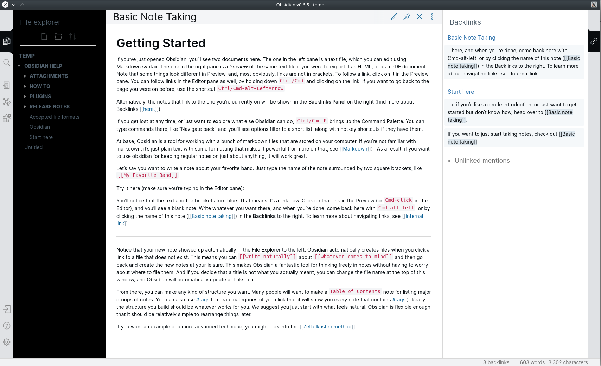

# obsidian-roam
Roam Theme for Obsidian
> Only Light theme

## Installation
1. Download obsidian.css file
2. In Obsidian click Settings->Plugins and turn on "Custom CSS".
3. Put the "obsidian.css" in your vault root folder.
4. Enjoy!

